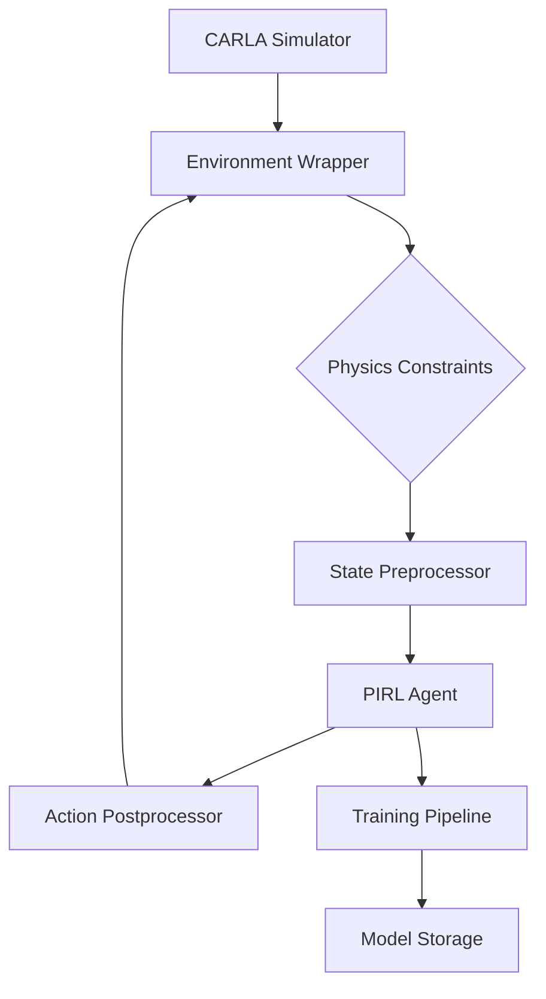

# Physics-Informed Reinforcement Learning for Autonomous Driving in CARLA

[](https://github.com/shashoriginal/pirl-carla)
[](https://github.com/shashoriginal/piril)

**Author**: Shashank Raj ([GitHub](https://github.com/shashoriginal))  
**Repository**: [piril-carla](https://github.com/shashoriginal/pirl-carla)  
**License**: PROPRIETARY (See [LICENSE](LICENSE))


## Architecture Overview


## Key Components
1. **Physics-Informed Agent**
   - Bicycle model integration
   - Collision prediction network
   - Safety constraint enforcement

2. **CARLA Interface**
   - Multi-sensor integration
   - Real-time vehicle control
   - Dynamic scenario management

3. **Training Framework**
   - Distributed experience replay
   - Automated hyperparameter tuning
   - Progressive difficulty scaling

## Installation
```bash
# Clone repository (requires access permissions)
git clone https://github.com/shashoriginal/pirl-carla.git
cd pirl-carla

# Install with safety constraints
pip install -r requirements.txt --trusted-host pypi.org --trusted-host files.pythonhosted.org
```

## License Restrictions
This project is currently under active development with restricted access. All rights reserved until public release. For licensing inquiries, contact the author.

## Documentation Structure
```
docs/
├── architecture.png
├── training_workflow.md
└── api_reference.md
```

[Full Documentation](docs/) | [Contribution Guidelines](CONTRIBUTING.md)
